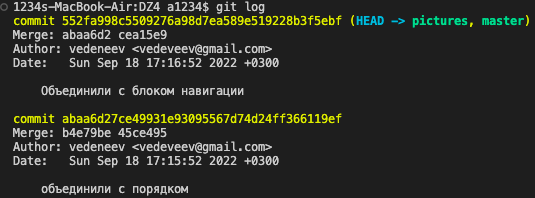
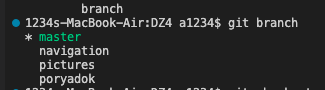

# Инструкция пользования Git

## Git команды

**git init** - инициализация локального репозитория

**git status** - получить информацию от git о его текущем состоянии

**git add** - добавить файл к следующему коммиту

**git commit -m "message"** - созание коммита

**git log** - вывод на жкан истории всех коммитов с их хеш-кодами

**git branch** - посмотреть список веток в репозитории

**git branch "название ветки"** - создать новую ветку

**git checkout "название ветки"** - переход к другой ветке

**git branch -d "название ветки"** - удалить ветку

**git dif** - разница нашего файла относительно последнего коммита

**git merge "название ветки"** - слияние веток

**git log -- graph** - посмотреть дерево веток 

**git branch -M "новое имя ветки"** - переименовать ветку

**git help** - вывести все команды Git

**clear** - очистить историю терминала

.gitignore - название папки, куда можно добавлять файлы, которые git должен игнорировать

## Порядок действий 

1. Создать папку, где будут храниться рабочий файлы

2. Создать локальный репозиторий внутри папки (git init)
3. Создать рабочий файл в нужном формате (.txt, .md,..)
4. Внести необходимые именения в файл 
5. Сделать рабочий файл отслеживаемым (git add .)
6. Зафиксировать первую версию файла (git commit -m "")
7. Внести необходимые именения в файл 
8. Сделать рабочий файл отслеживаемым (git add .)
9. Зафиксировать новую версию файла (git commit -m "")
Чтобы посмотреть все версии файла -  git log 

## Навигация по Git

* Переход от одной _версии_ файла к другой
    
    -узнать хеш-код необжодимой версии через команду git log

 

 Альтернативный вариант отображения хеш-кодов через команду - **git log --oneline**

 

    -скопировать первые 5 элементов хеш-кода
    
    -перейти в нужную версию через команду git checkout + 5 элементов хеш-кода

* Переход от одной _ветки_ к другой
    -определить в какой ветке находитесь в данный момент через команду git branch (выделена зеленым цветом)
 
 

    -через команду git checkout +название нужной ветки перейти

## Зачем создавать несколько веток

Деление на ветки позволет создавать черновую версию проекта, с возможностью сохранить промежуточные изменения. Также ветвление помогает работать в команде, разделяя блоки проекта между людьми, а в итогой версии объединить всю работу в итоговый файл.

Hello world